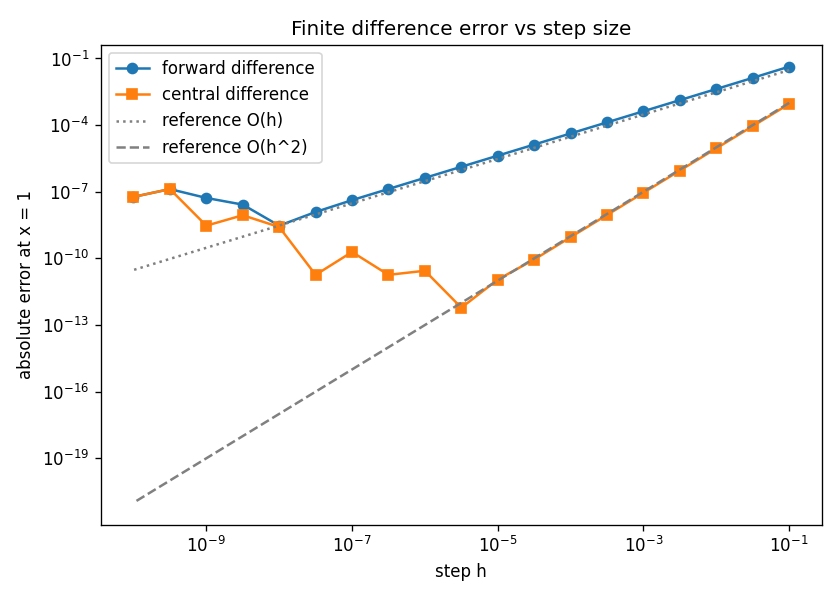
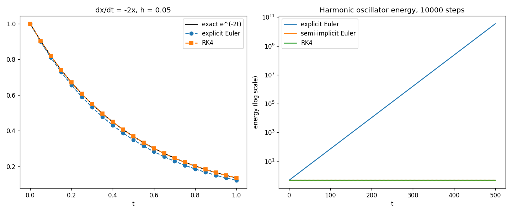
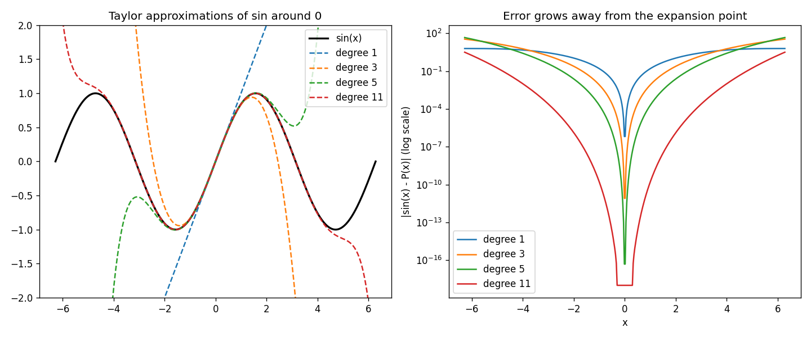
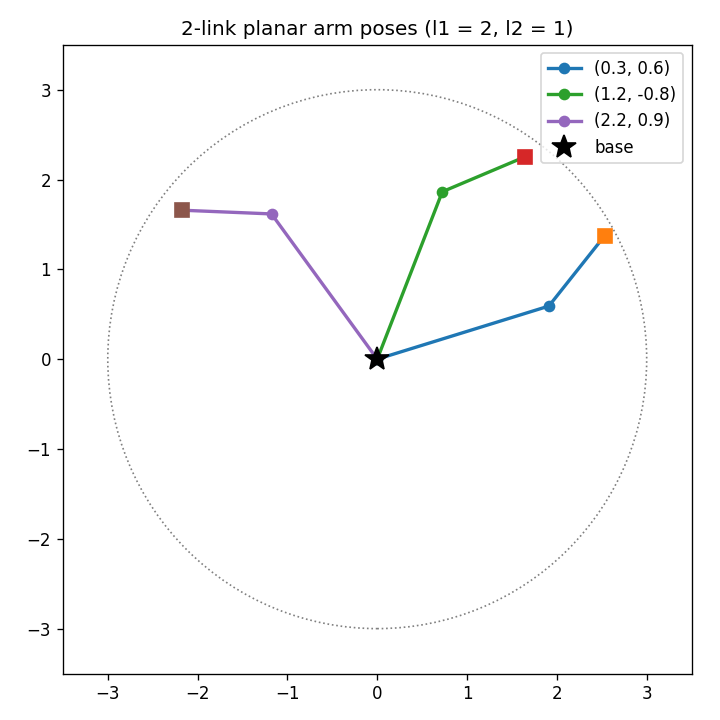

# Calculus to Code

[](https://github.com/sndsh404/numerics-notebook/actions/workflows/tests.yml)

A study repository that implements calculus, linear algebra, rigid body transforms, and basic machine learning from scratch in Python. The rule: numpy is allowed for arrays and plotting data, but no library does the math. No scipy, no sympy, no numpy.linalg, no numpy.gradient. Every derivative, integral, matrix solve, and gradient step is hand-written, and every module has pytest coverage.

## Contents

- [Modules](#modules)
- [Figures](#figures)
- [Quickstart](#quickstart)
- [License](#license)

## Modules

| Module | Topic | What it implements |
| --- | --- | --- |
| `calccode/limits.py` | Limits | Numerical limits from both sides, divergence and oscillation detection |
| `calccode/derivatives.py` | Derivatives | Forward, backward, central differences, convergence order fitting |
| `calccode/symbolic.py` | Symbolic differentiation | Expression trees, `diff()` with power, product, and chain rules |
| `calccode/integrals.py` | Integration | Riemann sums, trapezoid, Simpson, empirical order checks |
| `calccode/series.py` | Series | Taylor polynomials, partial sums, numeric ratio test |
| `calccode/integrators.py` | ODEs | Explicit Euler, semi-implicit Euler, RK4 |
| `calccode/optimize.py` | Root finding | Bisection, Newton, secant, with iteration histories |
| `calccode/multivar.py` | Multivariable calculus | Partials, gradient, Jacobian, Hessian, gradient checking |
| `calccode/gradient.py` | Gradient descent | 1D and 2D descent on central differences, learning rate study |
| `calccode/autograd.py` | Autodiff | Scalar reverse-mode autograd, MLP that fits sin(x) |
| `calccode/linalg.py` | Linear algebra | Matmul, determinant, Gaussian elimination, rank; no numpy.linalg |
| `calccode/transforms.py` | Robotics transforms | Rotations, Rodrigues' formula, quaternions, planar arm kinematics |
| `calccode/regression.py` | Machine learning | Least squares two ways, logistic regression |
| `calccode/ode_systems.py` | ODE systems | Nonlinear pendulum, Lotka-Volterra, Lorenz attractor on RK4 |
| `calccode/fourier.py` | Fourier analysis | Hand-written O(n^2) DFT, inverse, dominant frequency detection |
| `calccode/montecarlo.py` | Monte Carlo | Xorshift RNG, 1D and n-D integration, pi estimation, importance sampling |

Each module has a matching file in `notes/` with study notes on what the code shows and where it breaks.

## Figures

All figures regenerate with the two scripts in `scripts/`.



Forward and central difference errors on sin(x), with the roundoff floor below h = 1e-6.



Euler against RK4 on exponential decay, and harmonic oscillator energy over 10000 steps.



Taylor polynomials of growing degree, and how the error grows away from the expansion point.



Forward kinematics of a 2-link planar arm at three joint configurations.

## Quickstart

```bash
git clone https://github.com/sndsh404/numerics-notebook.git
cd numerics-notebook
pip install -r requirements.txt
python -m pytest tests/ -q
python scripts/make_plots.py
python scripts/make_plots_2.py
```

The plot scripts write to `plots/` (gitignored scratch) and `docs/img/` (tracked copies shown above).

## License

MIT. See [LICENSE](LICENSE).
